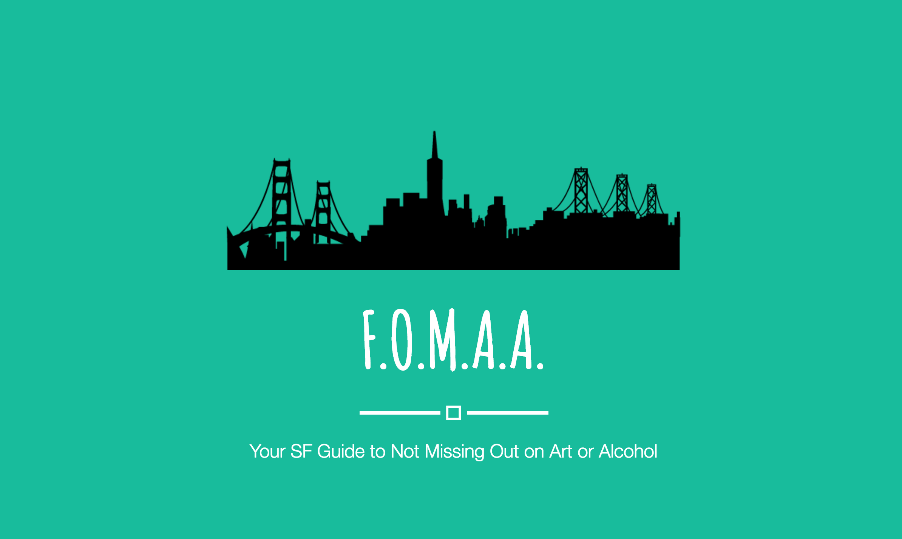
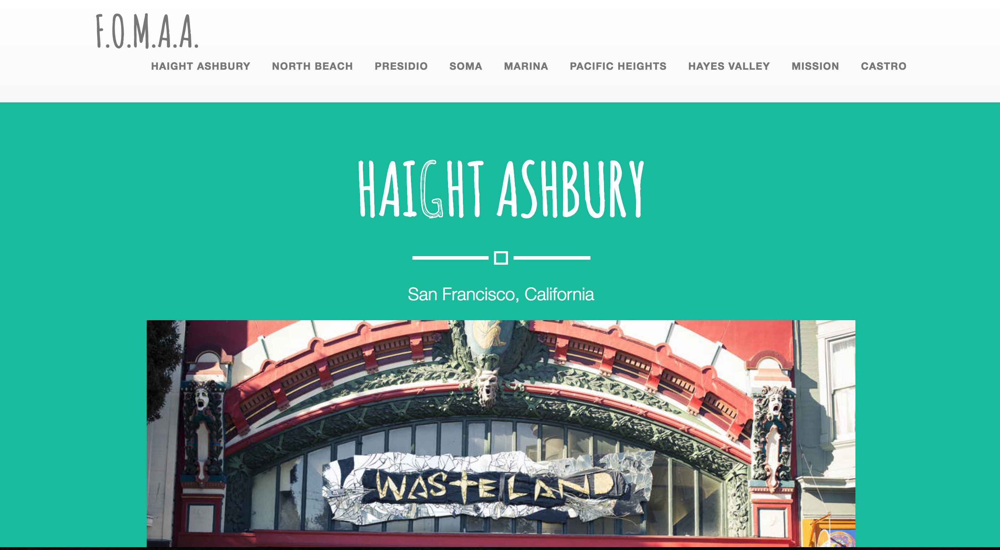
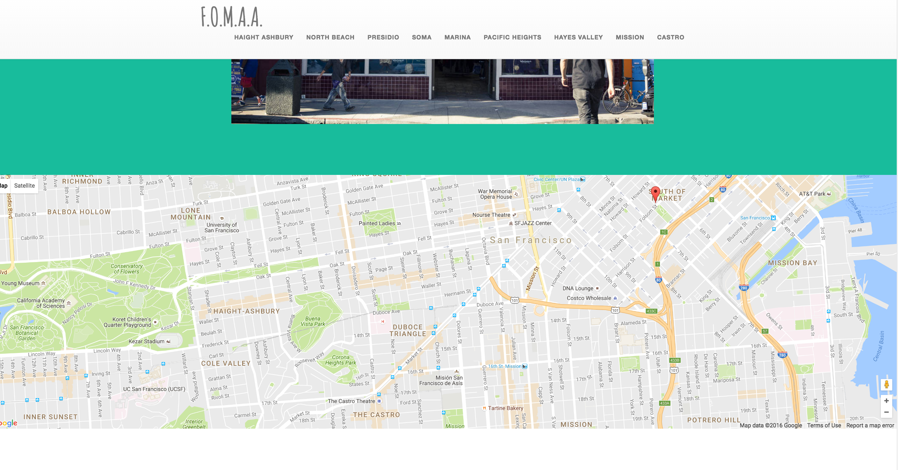
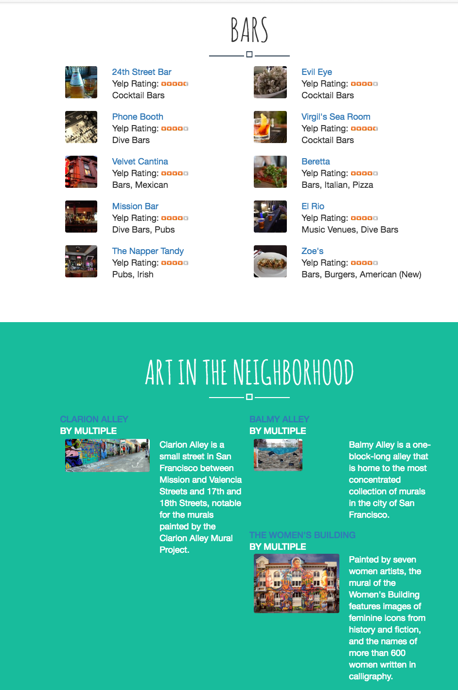

# 🎨 🍻[F.O.M.A.A](afternoon-river-53401.herokuapp.com)

 Your guide to exploring San Franciso and not missing out on Art and Alcohol. This stunning app guides you through neighborhood specific bar crawls centered around iconic SF public art. F.O.M.A.A. is buil with RoR, and uses te Google Maps API, Yelp API, and SF Civic Art Collections API. F.O.M.A.A was spun out of the San Francisco Women's Hackathon to help expats better explore the city. The project won FIRST PLACE for technical performace!

[Check it out!](afternoon-river-53401.herokuapp.com)

# Preview

## 1. Home Page

## 2. Gorgeous Neighborhood Specific Presentation

## 3. Info About Public Art and Bars

## 4. General Info About the Neighborhood

## Built With

* Sublime
* Ruby
* Rails 5.0
* Google Civic Art Collection API
* Google Maps API
* Yelp API

## Acknowledgments
Thanks to SF Women's Expat Community for putting on the SF Women's Hackathon that inspired this project!

### Get in touch if you are having any issues!
